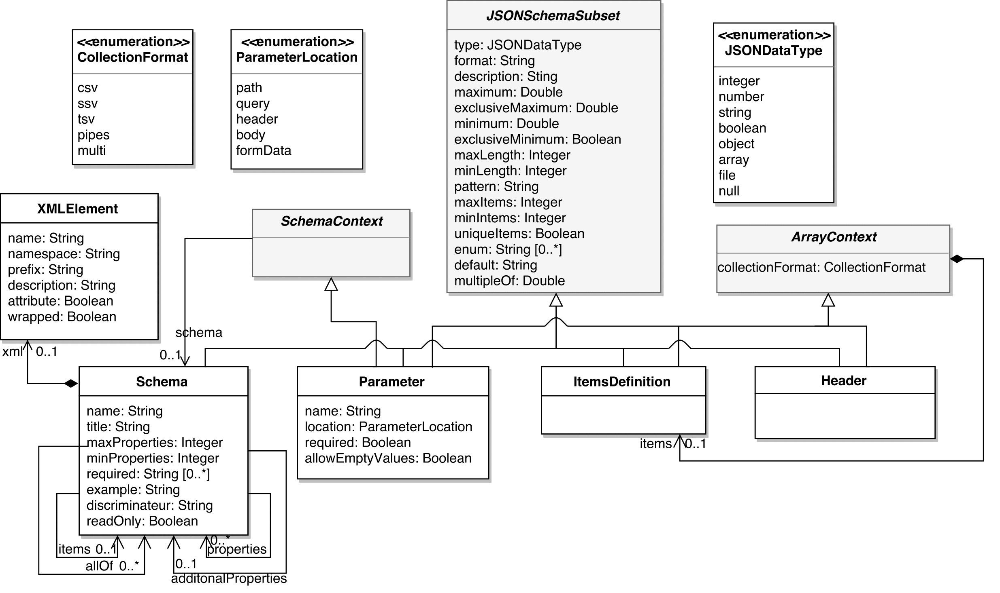
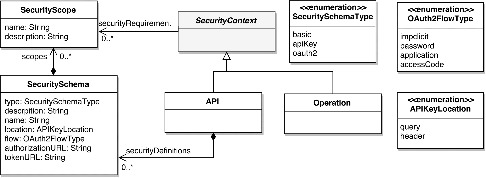

OpenAPI metamodel
=================

Bahavioral element
------------------

A REST Web API is represented by the `API` element, which is the root element of our metamodel. This element includes attributes to specify the version of the API (`swagger` attribute), the host serving the API, the base path of the API, the supported transfer protocols of the API (`schemes` attribute) and the list of MIME types the API can consume/produce. It also includes references to the available paths, the data types used by the operations (`definitions` reference) and the possible responses of the API calls.

The `Path` element contains a relative path to an individual endpoint and the operations for the HTTP methods (e.g., `get` and `put` references). The description of an operation (`Operation` element) includes an identifier `operationId`, the MIME types the operation can consume/produce, and the supported transfer protocols for the operation (`schemes` attribute). An operation includes also the possible responses returned from executing the operation (`responses` reference).

`API`, `Path` and `Operation` elements inherit from `ParameterContext`, which allow them to define parameters at API level (applicable for all API operations), path level (applicable for all the operations under this path) or operation level (applicable only for this operation).

The `Response` element defines the possible responses of an operation and includes the HTTP response code, a description, the list of headers sent with the response, and optionally an example of the response message. `Response` and `Parameters` elements inherit from `SchemaContext` thus allowing them to add the definition of the response structure and the data type (`schema` reference) used for the parameter, respectively.

Documentation and Metadata elements
--------------------------

The `API` element includes the `Info` element which describes the global information about the API namely and includes references to represent contact and license information. `API`, `Tag`, `Operation`, and `Schema` elements inherit from the `ExternalDocsContext` element to allow referencing external documentation.

Structural elements
-------------------

The structural elements includes:  the `Schema` element, which describes the data types; the `Parameter` element, which defines an operation parameter; the `ItemsDefiniton` element, which describes the type of items in an array; and the `Header` element, which describes a header sent as part of a response. These elements use an adapted subset of the JSON Schema Specification defined in the super class `JSONSchemaSubset`[1].

A parameter includes a name, and two flags to specify whether either the parameter is required or empty. The location of the parameter is defined by the `location` attribute. The possible locations are: 
-  `path`, when it is part of the URL (e.g., `petId` in `/pet/petId`); 
-  `query`, when it is appended to the URL (e.g., `status` in `/pet/findByStatus``?status=sold`); 
-  `header`, for custom headers;
-  `body`, when it is in the request payload;
-  `formData`, for specific payloads[2].

`Parameter` and `Header` elements inherit from `ArrayContext` to allow them to specify the collection format and the items definition for attributes of type `array`. Additionally the `Parameter` element inherits from the `SchemaContext` to define the data structure when the attribute `location` is of type body (`Schema` reference).

The `Schema` element defines the data types that can be consumed and produced by operations. It includes a name, a title, and an example. When the schema is of JSON type `object`, the definition includes also `maxProperties` and `minProperties` attributes to limit the number of schema properties, and the required properties. Inheritance and polymorphism is specified by using the `allOf` reference and the `discriminator` attribute, respectively. Furthermore, when the schema is of type `array`, the `items` reference allows the values of the array.

Security elements
-----------------

The `API` element may include a set of security definitions. The `SecuritySchema` element allows defining security schemes and includes a name to identify the scheme; a description; a type, which can be `basic` for basic authentication, `apiKey`, or `oauth2` for oauth2 common flows; and a location, which can be either `query` (i.e., as part query parameter in the URL) or `header` (i.e., as part of the header of the request).

For schemes of type `oauth2`, the definition includes also the flow used by the scheme which can be `implicit`, `password`, `application` and `accessCode`, the authorization and the token URLs to be used for the flow.

`API` and `Operation` elements inherit from the `SecurityContext` element thus allowing them to specify the alternative security schemes that can be used (`securityRequirement` reference). While the security schemes declared in the API level are applied for the API as a whole, the ones declared in a operation level are only applicable for such operation.

Serialization/Deserialization Support
-------------------------------------

The OpenAPI metamodel supports serialization and deserialization of OpenAPI models in JSON (or YAML) format. As said before, a parameter can be defined at the API level, path level, or operation level. To specify this, `API`, `Path`, and `Operation` elements inherit from the `ParameterDeclaringContext` element which is referenced in each parameter (`declaringContext` reference). A similar strategy is followed by the `Schema` element (the schema can be declared in the API level, parameter level, response level, or inside a schema) and the `Response` element (a response can declared at the API level or operation level).

All behavioral elements inherit from the `JSONPointer` element which defines a JSON reference for each element. This element includes a derived attribute called `ref` which is dynamically calculated depending on its declaring context. This attribute specifies the path of the element within a JSON document following RCF 6901[3] which can be used to reference a JSON object within the JSON document.

[1] More information about the schema information can be found at <http://goo.gl/WcpB86>

[2] `application/x-www-form-urlencoded` or `multipart/form-data`

[3] <https://tools.ietf.org/html/rfc6901>
